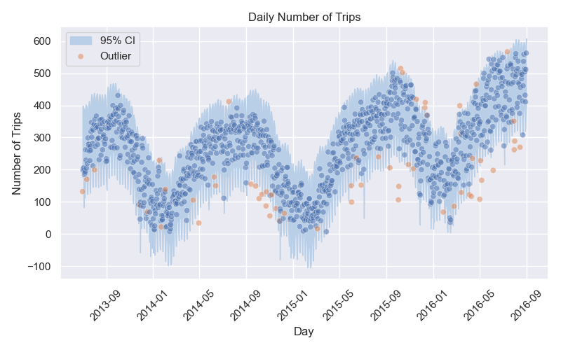

# Getting Started

First, create a virtual environment using the `requirements.txt` file, using the command `conda create --name <env> --file requirements.txt`

To generate all the plots and images used in the summary reports, simply run the jupyter notebooks after the virtual environment has been created. All plots and images will be generated in the `images` directory

# Executive Summary

In this section, I will give a brief overview of the major takeaways from each section. This section is only intended to summarize the overall results, and more details can be found within the respective sections.

## 1. Detection of potential outliers and anomalies for Citibike usage

I found that ultimately, there were two main sources of anomalies. The first one was in the `tripduration` variable, where I observed a lot of extremely high outliers, which can be visualized in the plot below.

As you can see, a lot of these outliers far exceed the 24hour usage limit that Citi Bike has, which means that these data points are either completely wrong, or there was a mis calculation in how their duration was measured. Additional analyses revealed that those were indeed incorrect datapoints or extreme usage case.

To observe a more representative distribution of the data, I then chose to retain only up to the 95th percentile of trip duration, losing only a small percentage of data points. The resulting distribution is shown below.

---

The next potential source of outliers was in the daily number of trips. I created an algorithm to forecast the daily number of trips on our existing range, and used the confidence interval to indicate which datapoint was out of the ordinary, as shown below.

Upon further examination, while there were some anecdotal correlations with unexpected temperatures, it was not enough to rule those outliers as anything other than statistical noise rather than data discrepancies.

## 2. Citibike usage forecast

## 3. Insights into bike stations based on the data