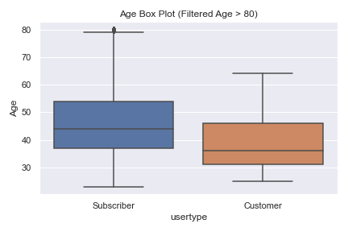

# Getting Started

First, create a virtual environment using the `requirements.txt` file, using the command `conda create --name <env> --file requirements.txt`

To generate all the plots and images used in the summary reports, simply run the jupyter notebooks after the virtual environment has been created. All plots and images will be generated in the `images` directory

# Executive Summary

In this section, I will give a brief overview of the major takeaways from each section. This section is only intended to summarize the overall results, and more details can be found within the respective sections.

## 1. Detection of potential outliers and anomalies for Citibike usage

I found that ultimately, there were two main source of anomalies. There were some smaller discrepancies in `trip distance`, but the main one was in the `tripduration` and `birth_year` variables, where I observed a lot of extremely high outliers. Let's start with `tripduration`.

### Trip Duration

As you can see, a lot of these outliers far exceed the **24hour usage limit** that Citi Bike has, which means that these data points are either completely **incorrect**, or there was a **mis calculation** in how their duration was measured. Additional analyses revealed that those were indeed incorrect datapoints or extreme usage case.

To observe a more representative distribution of the data, I then chose to retain only up to the **95th percentile** of trip duration, losing only a small percentage of data points. The resulting distribution is shown below.

---

### Age

We observed a similar pattern for age, whereby some records had extremely high ages in comparison to the median. However, all of those high cases were contained within "Subscriber" users, as shown below:

Given that the extreme cases were concentrated in one class, my assumption was that most of these data points must have been some data collection system. It is also entirely possible that some of these older customers are legitimate, especially since we see the average age being slightly higher for subscribers, but ages greater than 80 seem unreasonable.

So I have fileterd the dataset to only retain records of age 80 and below. This removed less than 0.3% of the data points available, but gave me more confidence in the dataset. The final disribution are shown below.

## 2. Citibike usage forecast

## 3. Insights into bike stations based on the data